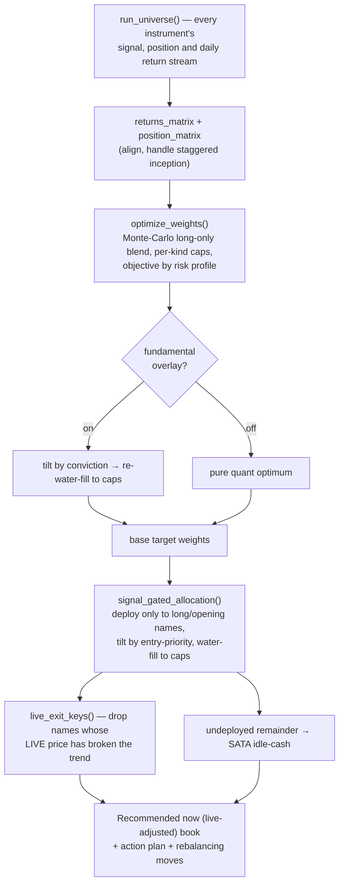

# 🧭 Overall Trading — Strategy & Mechanics

**How the combined cross-asset portfolio is built, sized, prioritised and
rebalanced each day.** This is the *how it works* doc; for out-of-sample
performance see
[`OVERALL_OOS_WALKFORWARD_EVAL.md`](OVERALL_OOS_WALKFORWARD_EVAL.md).

**Source of truth:** `app/overall_core.py` (all the maths) and
`app/overall_app.py` (the thin Streamlit layer + Methodology tab). Every number
and rule below is read from that code — no separate implementation.

---

## 1. The idea

Every other app trades **one** signal. *Overall Trading* runs all of them — each
app's 1× primary **plus its higher-beta / leveraged siblings** — through **one
unified daily engine**, so their signals, positions and back-tests sit
side-by-side and blend into a single portfolio built around one question:
**where should capital go today?**

The Overall app never imports the individual apps; it re-runs every instrument
through `overall_core.run_universe()` so the strategies are directly comparable
and blendable.

---

## 2. The universe — one signal, several instruments

Each app fires **one** signal; its 1× primary and its higher-beta / leveraged
siblings are **all traded off that parent signal** (never their own price),
exactly as the dedicated apps do. Instrument *kind* drives its weight cap:
`core` (1×), `beta` (high-beta equity), `lev` (2×/3× leveraged).

| Signal (parent) | Instruments (kind) | Engine |
|---|---|---|
| ₿ **BTC** | BTC `core` · MSTR `beta` · MSTU `lev` | CT-model Divergence · BTC & MSTR signal-exit-only, MSTU −6% |
| 🥇 **Gold (GLDM)** | GLDM `core` · GDX `beta` · UGL `lev` · NUGT `lev` | Divergence Pure-Regime · GLDM/GDX −3%, UGL signal-only, NUGT −5% |
| 🛢️ **XLE** | XLE `core` · OIH `beta` · ERX `lev` | Energy Divergence Pure-Regime · XLE/OIH −8%, ERX signal-only |
| 🖥️ **SOXX** | SOXX `core` · SOXL `lev` | Dual-MA 25/100 · SOXX −5%, SOXL signal-only |
| ⚡ **GRID** | GRID `core` | MACD 10/20/9, −5% |
| 🧲 **REMX** | REMX `core` | Dual-MA 50/200 golden cross, −5% |
| ⛏️ **WGMI** | WGMI `beta` | MA-50 + volatility filter, no fixed stop |
| ☀️ **PBW** | PBW `core` | Clean-Energy Divergence Pure-Regime |
| 🤖 **ARTY** | ARTY `core` | AI/Tech Divergence Pure-Regime |

That is **17 instruments across 9 signals**. Each runs the **exact engine its own
app trades** (BTC/MSTR/MSTU via the BTC app's trained CT model; GLDM/GDX/UGL/NUGT
via the Gold app's `backtest_gldm`; the ETFs via their `ticker_config` entries
through `backtest_ticker`), so the Overall numbers match each source app
bar-for-bar. Sibling stops are looser than the 1× because a tight stop whipsaws a
leveraged/high-beta name.

---

## 3. The daily decision pipeline



Signals run on **completed daily bars**; live spot prices are overlaid only on the
*display* and the live-adjusted book, never on the signals or back-test. The heavy
compute is cached ~30 min; spot quotes refresh ~1 min.

---

## 4. Return streams & the SATA idle-cash park

Each instrument's strategy is **long when its signal is on and otherwise flat** —
and flat capital is **not dead**. It is parked in **SATA** (*Strive Variable-Rate
Series A Perpetual Preferred*), a US-listed security paying a ~**13 %** annual
coupon as a daily dividend on $100 par (≈13.88 % effective reinvested). In
`overall_core`:

```
SATA_DAILY = 0.13 / 250 business days ≈ 0.00052 / day
```

The combined-curve maths (`_combine`) renormalises weights over the instruments
that actually have data each day (staggered inception — BTC's CT features begin
~2024), and any **deployed weight that is sitting out of the market that day earns
`SATA_DAILY`** instead of nothing. A fully-cash day earns the SATA yield. So the
back-test reflects cash *working*, and the live book's undeployed remainder goes
to SATA too.

---

## 5. How the allocation mix is determined & optimised

`optimize_weights()` searches **long-only** blends (weights sum to 1) by
Monte-Carlo:

1. **Sample** ~20,000 weight vectors from a Dirichlet, **keep only those within
   the per-instrument caps**, and add two structured candidates — cap-normalised
   **equal-weight** and inverse-vol **risk-parity**.
2. **Score every candidate** (vectorised): build the combined daily return stream
   with idle→SATA, compound to an equity curve, and read off `total_ret`, `cagr`,
   `mdd`, `sharpe`, `vol`.
3. **Filter to the drawdown budget** — keep candidates with `mdd ≥ mdd_floor`.
4. **Pick by objective:**
   - `balanced` → among blends within **8 % of the best Sharpe** (`sharpe ≥ 0.92 ×
     max`), take the **highest raw return**. Holds Sharpe near its max while still
     grabbing return.
   - `max_return` → the **highest raw return** inside the drawdown budget (leans
     harder on the high-return β / 2× sleeves).
   - `max_sharpe` → pure Sharpe.

**Per-instrument caps** are the core control that keeps the leveraged sleeves
honest — the optimiser can only lean on a 2× / β name up to its cap, so it takes
that exposure **only when it genuinely improves the risk-adjusted result**:

| Kind | Balanced | Growth | Aggressive |
|---|---:|---:|---:|
| `core` (1×) | 30 % | 30 % | 35 % |
| `beta` (high-beta) | 18 % | 25 % | 40 % |
| `lev` (2×/3×) | 10 % | 18 % | 35 % |

Caps are enforced by a **water-fill**: normalise to 1, clip anything over its cap,
redistribute the overflow to the names with room, repeat; anything the caps can't
absorb becomes cash/SATA.

### Risk profiles

A profile bundles the caps, the optimiser objective and the drawdown budget, so
the user dials the return-vs-risk trade-off on the Live tab:

| Profile | Objective | Drawdown floor | Behaviour |
|---|---|---:|---|
| **Balanced** | `balanced` (near-max-Sharpe, then max return) | −35 % | Best historical **risk-adjusted** blend. |
| **Growth** *(default)* | `max_return` | −22 % | Leans harder on β / 2× for more return inside a tighter DD budget. |
| **Aggressive** | `max_return` | −38 % | Heaviest β / 2×: highest return, deepest drawdowns, lower Sharpe. |

Loading the β + 2× sleeves **boosts return but lowers Sharpe** — the drawdown
deepens faster than the return — which is exactly the knob these profiles expose.

### Fundamental overlay (optional)

With the overlay **on** (default), the quant-optimal blend is multiplied by a
per-instrument **conviction score** (mid-2026 sector view — overweight AI/semis,
crypto, structural gold, electrification; underweight clean energy & oil
services), then **re-water-filled to the same caps**. High-conviction names are
allowed a small floor so a name the pure optimum ignored can still enter. The app
shows both the with- and without-overlay figures so the tilt is transparent.

---

## 6. Entry-priority logic

The optimiser says *how much* each instrument is worth **on average**; priority
decides **which signals get funded today, and how much**, when several compete
(multiple entries firing, or one firing while others are held).

`compute_priorities()` builds a score in **[0, 1]** for each candidate, blending
five current-conditions reads, **each min-max-normalised across the competing
candidate set** (so the ranking is relative to what's actually on the table
today):

| Component | Weight | What it reads |
|---|---:|---|
| **momentum** | 0.28 | distance of the live price above the 50-day SMA |
| **sentiment** | 0.24 | the app's 0–100 macro-sentiment gauge (`sent/100`) |
| **win_rate** | 0.20 | the strategy's back-tested win-rate (`win%/100`) |
| **sharpe** | 0.18 | its out-of-sample risk-adjusted edge |
| **regime** | 0.10 | 1 if the parent is in a bull regime, else 0 |

```
score = 0.28·momentum + 0.24·sentiment + 0.20·win_rate + 0.18·sharpe + 0.10·regime
```

The priority then **tilts** the optimal weight — each candidate's raw target is:

```
raw_target(k) = optimal_weight(k) × (0.5 + score(k))      # a 0.5×…1.5× multiplier
```

which is then water-filled to the caps. So the highest-priority signals in
today's tape get the largest slices, anchored to (but never unbounded by) the
historically-optimal weight.

---

## 7. Today's book — signal-gated allocation

`signal_gated_allocation()` turns the tilted weights into an actionable book:

- **Deploy capital only** to instruments the strategy is **long** (holding) or
  **opening** a fresh entry. A committed exit (or a caller-forced live exit) drops
  the name.
- Size the deployed names by `raw_target` above, **water-filled to the caps**; the
  deployed risk assets total 100 % when the caps allow.
- **Whatever can't be deployed is parked in SATA.** With **no open positions the
  entire book sits in SATA**, earning its yield until a signal fires.
- It emits three books for the donuts:
  - **Current book** — what's held right now (optimal weights, no priority tilt).
  - **Recommended today** — the committed last-close signals, priority-tilted.
  - **Recommended now (live-adjusted)** — additionally drops any position whose
    **live** price has fallen below its trend filter (`live_exit_keys` re-runs each
    mode's real long condition — e.g. a `dual_ma` death-cross, not a naïve
    price-vs-line proxy — so a golden-cross name isn't mis-flagged) and reallocates
    to the survivors and SATA.
- **Action plan.** Every instrument gets a ranked action — **CLOSE** (exits
  first), then **OPEN** / **HOLD**, then **WATCH** / **STAND ASIDE** — each with
  its priority, live price, unrealised P&L vs the real entry-bar cost basis, and
  both last-bar and live target %/$.

The **rebalancing moves** are just `current → adjusted target` per instrument,
with the delta routed to/from SATA. A user **include/exclude** overlay
(`adjust_for_selection`) can drop a position; its weight moves to **SATA**, with
no redistribution to the survivors (so `deployed + cash` is invariant).

---

## 8. What the back-test measures

The combined curve is scored over staggered-start, genuinely out-of-sample
windows (each stream begins at its instrument's OOS start):

- 🌐 Full OOS (2021 → now) · 🐻 Bear (2021–2022) · 🐂 Bull (2023 → now) ·
  🔬 Recent (2025 → now)

against equal-weight buy-&-hold of the underlyings and equal-weight / risk-parity
blends of the strategies. Numbers and the full walk-forward are in
[`OVERALL_OOS_WALKFORWARD_EVAL.md`](OVERALL_OOS_WALKFORWARD_EVAL.md).

---

## 9. Caveats

- **Optimal weights are in-sample** — the best *historical* blend fit on this same
  history, not a promise. Equal-weight and risk-parity need no fitting and are
  shown for comparison.
- **SATA is modelled** as always having existed, flat at $100 par, paying its
  ~13 % daily dividend across every period — an assumption, not a market-tested
  series.
- **Leveraged 2× / 3× sleeves compound decay and gap risk**; the caps bound but
  don't remove it. See [`LEV_SIBLINGS_STOP_EVAL.md`](LEV_SIBLINGS_STOP_EVAL.md)
  and [`SOXL_ERX_ADDITION_EVAL.md`](SOXL_ERX_ADDITION_EVAL.md).
- This is a **daily** engine. The BTC and Gold apps' canonical **hourly**
  Pure-Regime signals live in those apps.
- Nothing here is investment advice.

---

## 10. Code & doc map

| Piece | Where |
|---|---|
| Universe, engine, optimiser, priority, SATA, caps | `app/overall_core.py` |
| Streamlit cockpit + Methodology tab | `app/overall_app.py` |
| Per-asset engines reused | `app/btc_ct_engine.py` · `app/gldm_engine.py` · `backtest_ticker.py` |
| Out-of-sample performance | [`OVERALL_OOS_WALKFORWARD_EVAL.md`](OVERALL_OOS_WALKFORWARD_EVAL.md) |
| Universe composition changes | [`VEGN_REMOVAL_EVAL.md`](VEGN_REMOVAL_EVAL.md) · [`SOXL_ERX_ADDITION_EVAL.md`](SOXL_ERX_ADDITION_EVAL.md) |
| Per-signal strategy specs | [`TRADING_STRATEGY.md`](TRADING_STRATEGY.md) · [`GLDM_TRADING_STRATEGY.md`](GLDM_TRADING_STRATEGY.md) · [`TICKER_APPS_README.md`](TICKER_APPS_README.md) |
| Live execution on IBKR | [`IBKR_PAPER_TRADING.md`](IBKR_PAPER_TRADING.md) |
