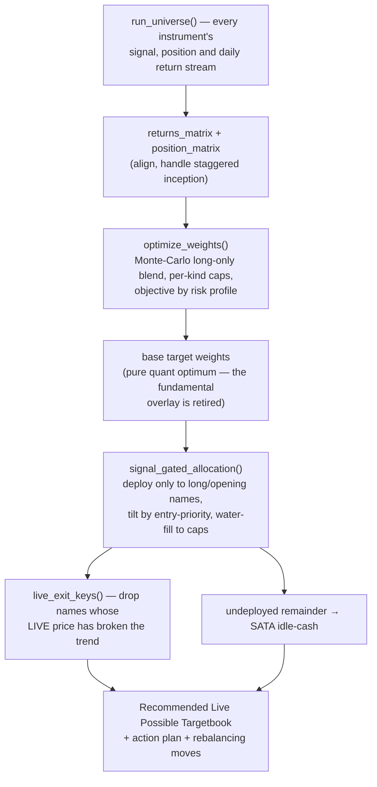

# 🧭 Overall Trading — Strategy & Mechanics

**How the combined cross-asset portfolio is built, sized, prioritised and
rebalanced each day.** This is the *how it works* doc; for out-of-sample
performance see
[`OVERALL_OOS_WALKFORWARD_EVAL.md`](OVERALL_OOS_WALKFORWARD_EVAL.md).

**Source of truth:** `app/overall_core.py` (all the maths) and
`app/overall_app.py` (the thin Streamlit layer + Methodology tab). Every number
and rule below is read from that code — no separate implementation.

---

## 1. The idea

Every other app trades **one** signal. *Overall Trading* runs all of them — each
app's 1× primary **plus its higher-beta / leveraged siblings** — through **one
unified daily engine**, so their signals, positions and back-tests sit
side-by-side and blend into a single portfolio built around one question:
**where should capital go today?**

The Overall app never imports the individual apps; it re-runs every instrument
through `overall_core.run_universe()` so the strategies are directly comparable
and blendable.

---

## 2. The universe — one signal, several instruments

Each app fires **one** signal; its 1× primary and its higher-beta / leveraged
siblings are **all traded off that parent signal** (never their own price),
exactly as the dedicated apps do. Instrument *kind* drives its weight cap:
`core` (1×), `beta` (high-beta equity), `lev` (2×/3× leveraged).

| Signal (parent) | Instruments (kind) | Engine |
|---|---|---|
| ₿ **BTC** | BTC `core` · MSTR `beta` · MSTU `lev` · ETH `core` | CT-model Divergence · BTC signal-exit-only; MSTR −3% · MSTU −6% · ETH −8% (2026-07-25 honest-fill re-sweep) |
| 🥇 **Gold Trend (GLDM)** | GLDM `core` · UGL `lev` | Dual-MA 25/100 on the GLDM close · −3% stops |
| ⛏️ **Gold Miners (GDXM)** | GDX `beta` · NUGT `lev` | Divergence Pure-Regime on the GLDM signal · GDX −5% / NUGT −8% (2026-07-25 re-sweep) |
| 🛢️ **XLE** | XLE `core` · OIH `beta` · ERX `lev` | Crash-shield quasi-B&H (exit >30% below 52-wk high, re-enter above SMA50) · no fixed stop |
| 🖥️ **SOXX** | SOXX `core` · SOXL `lev` | Dual-MA 25/100 · SOXX −5%, SOXL signal-only |
| ⚡ **GRID** | GRID `core` | MACD 10/20/9, −5% |
| 🧲 **REMX** | REMX `core` | Dual-MA 50/200 golden cross, −5% |
| ⛏️ **WGMI** | WGMI `beta` | MA-50 + volatility filter, no fixed stop |
| ☀️ **PBW** | PBW `core` | Clean-Energy Divergence Pure-Regime |
| 🤖 **ARTY** | ARTY `core` | AI/Tech Divergence Pure-Regime |

That is **18 instruments across 10 parent apps** (the two gold apps share one
GLDM-derived signal). Each runs the **exact engine its own
app trades** (BTC/MSTR/MSTU/ETH via the BTC app's trained CT model; GLDM/GDX/UGL/NUGT
via the Gold app's `backtest_gldm`; the ETFs via their `ticker_config` entries
through `backtest_ticker`), so the Overall numbers match each source app
bar-for-bar. Sibling stops are looser than the 1× because a tight stop whipsaws a
leveraged/high-beta name.

**ETH (added 2026-07f)** — **spot Ethereum** is the fourth sleeve on the BTC
parent signal, traded with the MSTR treatment (Standard-MA gate; a −8% stop
since the 2026-07-25 honest-fill re-sweep). Its bars share BTC's **12:00-UTC anchor**, so
the sleeve's same-bar fill lands exactly at the signal bar's close and its
history spans the whole CT window. **Live execution routes to the ETHA ETF**,
exactly as the BTC sleeve executes via IBIT (`scripts/ibkr_symbols.py`) — the
signal asset and the traded vehicle are deliberately different. Surfaced both
here and as a **🔹 ETH Backtesting** tab (plus live signal/position panels and a
price tile) in the ₿ Bitcoin app.

> ⚠️ **ETH is the weakest sleeve in the universe and is not an endorsement.** On
> the honest fill it returns **+8.8 % at −39.5 % / Sharpe 0.23** (vs ETH
> buy-&-hold −51.4 %), it is **0.80-correlated to the BTC sleeve**, it *lowers*
> Balanced Sharpe in every MC seed tested, and it costs the deterministic
> equal-weight book **−38 pp**. The earlier ETHA-based case for adding it was
> inflated by a fill that preceded the signal and by a shorter window. Full
> analysis, plus a **larger pre-existing look-ahead affecting MSTR/MSTU —
> fixed 2026-07-25** (equity fills now land at the first exchange close after
> the signal moment; config-unchanged MSTR +296%→+184%, MSTU +685%→+402%;
> after the honest-fill stop re-sweep MSTR +245%, MSTU +677%):
> [`ETH_BMNR_STRATEGY_EVAL.md`](ETH_BMNR_STRATEGY_EVAL.md) §4–§5. BMNR was
> evaluated alongside and rejected.

---

## 3. The daily decision pipeline



Signals run on **completed daily bars**; live spot prices are overlaid only on the
*display* and the live-adjusted book, never on the signals or back-test. The heavy
compute is cached ~30 min; spot quotes refresh ~1 min.

---

## 4. Return streams & the SATA idle-cash park

Each instrument's strategy is **long when its signal is on and otherwise flat** —
and flat capital is **not dead**. It is parked in **SATA** (*Strive Variable-Rate
Series A Perpetual Preferred*), a US-listed security paying a ~**13 %** annual
coupon as a daily dividend on $100 par (≈13.88 % effective reinvested). In
`overall_core`:

```
SATA_DAILY = 0.13 / 250 business days ≈ 0.00052 / day
```

The combined-curve maths (`_combine`) renormalises weights over the instruments
that actually have data each day (staggered inception — BTC's CT features begin
~2024), and any **deployed weight that is sitting out of the market that day earns
`SATA_DAILY`** instead of nothing. A fully-cash day earns the SATA yield. So the
back-test reflects cash *working*, and the live book's undeployed remainder goes
to SATA too.

### The published back-test is the walk-forward gated replay

`_combine` (fixed weights held over the whole history) remains the optimiser's
internal scoring engine, but the **numbers the app publishes** — headline
metrics, profile comparison, Growth-of-$100k curve, period breakdown, the
"P&L from your start date" section and its attribution charts — come from
`walkforward_gated_replay()`: a day-by-day replay of `signal_gated_allocation`
in which

* the **funded set** each day is the sleeves the engines actually held (decided
  at the previous close), with position state **carried across non-trading
  days** — the crypto sleeves put weekends into the calendar, and a carried
  equity position keeps its weight while contributing 0 return until its next
  bar, instead of looking "sold" into a phantom crypto/SATA weekend book,
* each sleeve is sized by **anchor weights × (0.5 + entry-priority)**, priority
  rebuilt daily from as-of inputs (momentum vs SMA50, the rolling sentiment
  gauge, *expanding* win-rate and Sharpe, the MA20 bull-regime rule), lagged one
  bar and water-filled to the profile caps,
* the **anchor weights are re-fit at each quarter start (Jan/Apr/Jul/Oct 1) on
  data strictly before that date** (cap-normalised equal weight during the
  first-year warm-up), with the (now fully retired) fundamental overlay
  excluded — quarterly replaced the original annual cadence after the
  adaptivity study (`OVERALL_ADAPTIVE_EVAL.md`) showed it wins on both return
  and Sharpe while every other candidate (rolling-window anchors, rolling
  priority stats, penalty box) was neutral-to-negative,
* **SATA accrues on weekday bars only** — its coupon is 0.13/250 per *business*
  day, so crediting the crypto calendar's weekend bars would compound the cash
  yield to ~19%/yr instead of ~13% (US market holidays still credit under the
  weekday rule — a ≲0.7%/yr residual on the cash slice, noted, not modelled).

Nothing in the published curve uses information from after the day it
describes; `scripts/check_lookahead.py` enforces this by truncation
(prefix-invariance) at multiple cutoffs, and `OVERALL_GATED_REPLAY_EVAL.md`
quantifies each layer's effect. Remaining honest limits: per-sleeve strategy
*parameters* are tuned on history, the BTC CT model's training window extends
into the displayed period, no transaction costs are charged, and SATA's yield
is assumed constant across the whole history.

### Reading the as-published 🧾 daily trade log

The P&L section's second source — the **as-published record** — compounds the
archived target books (`data/overall/book_archive/`, one per signal day), and
its trade log lists one row per book that actually *moved*. Two properties of
that record decide where the log's newest row sits, and neither means the feed
has stalled:

* **A publish that repeats the previous book produces no ticket.** Once every
  surviving sleeve sits at its profile cap, the water-fill has nothing left to
  re-size: the book is re-committed unchanged day after day (turnover 0.0%) and
  the idle remainder simply earns SATA. The log's newest row then stays at the
  last book that changed while the archive keeps advancing — e.g. the record
  ran unchanged from the 2026-08-27 book (XLE 30% · OIH 18% · ERX 10% ·
  SATA 42%, all three at cap) for the following week. `book_change_status`
  counts that run so the table can say so in a 🟰 row instead of just ending.
* **The newest publish is not in the weight matrix yet.** Day *d* is earned by
  the latest book with `as_of` strictly before *d*, so the book committed this
  morning (whose `as_of` is the last completed bar) reaches the matrix only
  once the next bar prints. `pending_book_tickets` lists those tickets
  separately — marked ⏳, with no P&L, because the bar they will earn has not
  happened — so an open or a close is visible in the log the day it is
  published rather than a day later.

Both helpers live in `app/overall_core.py` and are covered by
`tests/test_book_ticket_visibility.py`.

---

## 5. How the allocation mix is determined & optimised

`optimize_weights()` searches **long-only** blends (weights sum to 1) by
Monte-Carlo:

1. **Sample** ~20,000 weight vectors from a Dirichlet, **keep only those within
   the per-instrument caps**, and add two structured candidates — cap-normalised
   **equal-weight** and inverse-vol **risk-parity**.
2. **Score every candidate** (vectorised): build the combined daily return stream
   with idle→SATA, compound to an equity curve, and read off `total_ret`, `cagr`,
   `mdd`, `sharpe`, `vol`.
3. **Filter to the drawdown budget** — keep candidates with `mdd ≥ mdd_floor`.
4. **Pick by objective:**
   - `balanced` → among blends within **8 % of the best Sharpe** (`sharpe ≥ 0.92 ×
     max`), take the **highest raw return**. Holds Sharpe near its max while still
     grabbing return.
   - `max_return` → the **highest raw return** inside the drawdown budget (leans
     harder on the high-return β / 2× sleeves).
   - `max_sharpe` → pure Sharpe.

**Per-instrument caps** are the core control that keeps the leveraged sleeves
honest — the optimiser can only lean on a 2× / β name up to its cap, so it takes
that exposure **only when it genuinely improves the risk-adjusted result**:

| Kind | Balanced | Growth | Aggressive |
|---|---:|---:|---:|
| `core` (1×) | 30 % | 30 % | 35 % |
| `beta` (high-beta) | 18 % | 25 % | 40 % |
| `lev` (2×/3×) | 10 % | 18 % | 35 % |

Caps are enforced by a **water-fill**: normalise to 1, clip anything over its cap,
redistribute the overflow to the names with room, repeat; anything the caps can't
absorb becomes cash/SATA.

### Risk profiles

A profile bundles the caps, the optimiser objective and the drawdown budget, so
the user dials the return-vs-risk trade-off on the Live tab:

| Profile | Objective | Drawdown floor | Behaviour |
|---|---|---:|---|
| **Balanced** *(default)* | `balanced` (near-max-Sharpe, then max return) | −35 % | Best historical **risk-adjusted** blend. |
| **Growth** | `max_return` | −22 % | Leans harder on β / 2× for more return inside a tighter DD budget. |
| **Aggressive** | `max_return` | −38 % | Heaviest β / 2×: highest return, deepest drawdowns, lower Sharpe. **Retired from the app UI** (budget judged too deep to publish); still available to the CLI tools. |

Loading the β + 2× sleeves **boosts return but lowers Sharpe** — the drawdown
deepens faster than the return — which is exactly the knob these profiles expose.

Committed artifact (2026-07-25, all sleeves on the causal-model retunes, the
XLE crash-shield, the gold middle path split across its two parent apps —
🥇 Gold Trend (GLDM/UGL dual-MA 25/100) and ⛏️ Gold Miners (GDX/NUGT
divergence) — and the ETH sleeve on the BTC signal; 18 instruments,
OOS 2021→now): **Balanced +826 % / −16.1 % MDD / Sharpe 2.38 ·
Growth +1,653 % / −20.1 % / 1.79 · Aggressive +2,105 % / −32.0 % / 1.48** vs
the equal-weight buy-&-hold benchmark +198 % / −39.0 % / 0.68.
Reproduce with `python scripts/build_overall.py`.

Per-period (Balanced optimum): 🌐 Full OOS 2021→now **+826 % / −16.1 % / 2.38** ·
🐻 Bear 2021-22 **+40.5 % / −8.0 % / 1.40** · 🐂 Bull 2023→now
**+552 % / −16.1 % / 2.74** · 🔬 Recent 2025→now **+213 % / −9.3 % / 3.28**.

*Note the ETHA→ETH swap cost the Balanced profile ~0.2 Sharpe (2.60 → 2.38) and
roughly doubled its drawdown (−8.6 % → −16.1 %): the ETHA figures it replaces
were flattered by an early fill, not beaten by better trading.*

### Fundamental overlay — retired

Earlier builds could multiply the quant-optimal blend by a per-instrument
**conviction score** (the mid-2026 sector view) before re-water-filling to the
caps. The overlay is now **retired everywhere** — the app checkbox is gone and
the daily Target-Book publisher passes `fundamental=False` — because the view
was formed knowing how 2021→2026 played out: using it anywhere bakes a
hindsight-formed conviction into the sizing. `FUNDAMENTAL_VIEW` remains in
`overall_core` only as a documented record; all published allocations are the
pure quant optimum under the profile caps.

---

## 6. Entry-priority logic

The optimiser says *how much* each instrument is worth **on average**; priority
decides **which signals get funded today, and how much**, when several compete
(multiple entries firing, or one firing while others are held).

`compute_priorities()` builds a score in **[0, 1]** for each candidate, blending
five current-conditions reads, **each min-max-normalised across the competing
candidate set** (so the ranking is relative to what's actually on the table
today):

| Component | Weight | What it reads |
|---|---:|---|
| **momentum** | 0.28 | distance of the live price above the 50-day SMA |
| **sentiment** | 0.24 | the app's 0–100 macro-sentiment gauge (`sent/100`) |
| **win_rate** | 0.20 | the strategy's back-tested win-rate (`win%/100`) |
| **sharpe** | 0.18 | its out-of-sample risk-adjusted edge |
| **regime** | 0.10 | 1 if the parent is in a bull regime, else 0 |

```
score = 0.28·momentum + 0.24·sentiment + 0.20·win_rate + 0.18·sharpe + 0.10·regime
```

The priority then **tilts** the optimal weight — each candidate's raw target is:

```
raw_target(k) = optimal_weight(k) × (0.5 + score(k))      # a 0.5×…1.5× multiplier
```

which is then water-filled to the caps. So the highest-priority signals in
today's tape get the largest slices, anchored to (but never unbounded by) the
historically-optimal weight.

---

## 7. Today's book — signal-gated allocation

`signal_gated_allocation()` turns the tilted weights into an actionable book:

- **Deploy capital only** to instruments the strategy is **long** (holding) or
  **opening** a fresh entry. A committed exit (or a caller-forced live exit) drops
  the name.
- Size the deployed names by `raw_target` above, **water-filled to the caps**; the
  deployed risk assets total 100 % when the caps allow.
- **Whatever can't be deployed is parked in SATA.** With **no open positions the
  entire book sits in SATA**, earning its yield until a signal fires.
- The Live tab's three donuts are:
  - **Previous Targetbook** — the published book that preceded the current one
    (`data/overall/target_book*_prev.json`, rotated at each publish).
  - **Current Targetbook** — the *officially published* book
    (`data/overall/target_book*.json`): all tickers as of the last US market
    close (yesterday) and BTC · MSTR · MSTU · ETH as of the 7:00-AM-CT Bitcoin bar
    close today. Frozen until the next 7:15-AM-CT publish (or a manual 🚀
    publish from the UI).
  - **Recommended Live Possible Targetbook** — the possible target book
    **today's live prices point to**: the committed last-close signals,
    priority-tilted, re-run with each asset's live price as the provisional
    close. A held position whose **live** price has fallen below its trend
    filter is dropped (`live_exit_keys` re-runs each mode's real long
    condition — e.g. a `dual_ma` death-cross, not a naïve price-vs-line
    proxy — so a golden-cross name isn't mis-flagged), and a flat name whose
    **live** price now satisfies its real entry condition is funded as a
    likely entry at its priority-tilted size (`live_entry_keys` →
    `signal_gated_allocation(force_entry=…)`), reallocating the remainder to
    the survivors and SATA. It can change through the day because today's
    market and BTC bars have not closed; it becomes official only when
    published — the published book never pre-funds a signal before it
    commits at the close.
- **Action plan.** Every instrument gets a ranked action — **CLOSE** (exits
  first), then **OPEN** / **HOLD**, then **WATCH** / **STAND ASIDE** — each with
  its priority, live price, unrealised P&L vs the real entry-bar cost basis, and
  both last-bar and live target %/$.

The **rebalancing moves** are just `current → adjusted target` per instrument,
with the delta routed to/from SATA. A user **include/exclude** overlay
(`adjust_for_selection`) can drop a position; its weight moves to **SATA**, with
no redistribution to the survivors (so `deployed + cash` is invariant).

---

## 8. What the back-test measures

The combined curve is scored over staggered-start, genuinely out-of-sample
windows (each stream begins at its instrument's OOS start):

- 🌐 Full OOS (2021 → now) · 🐻 Bear (2021–2022) · 🐂 Bull (2023 → now) ·
  🔬 Recent (2025 → now)

against equal-weight buy-&-hold of the underlyings and equal-weight / risk-parity
blends of the strategies. Numbers and the full walk-forward are in
[`OVERALL_OOS_WALKFORWARD_EVAL.md`](OVERALL_OOS_WALKFORWARD_EVAL.md).

---

## 9. Caveats

- **Optimal weights are in-sample** — the best *historical* blend fit on this same
  history, not a promise. Equal-weight and risk-parity need no fitting and are
  shown for comparison.
- **SATA is modelled** as always having existed, flat at $100 par, paying its
  ~13 % daily dividend across every period — an assumption, not a market-tested
  series.
- **Leveraged 2× / 3× sleeves compound decay and gap risk**; the caps bound but
  don't remove it. See [`LEV_SIBLINGS_STOP_EVAL.md`](LEV_SIBLINGS_STOP_EVAL.md)
  and [`SOXL_ERX_ADDITION_EVAL.md`](SOXL_ERX_ADDITION_EVAL.md).
- This is a **daily** engine. The BTC and Gold apps' canonical **hourly**
  Pure-Regime signals live in those apps.
- Nothing here is investment advice.

---

## 10. Code & doc map

| Piece | Where |
|---|---|
| Universe, engine, optimiser, priority, SATA, caps | `app/overall_core.py` |
| Streamlit cockpit + Methodology tab | `app/overall_app.py` |
| Per-asset engines reused | `app/btc_ct_engine.py` · `app/gldm_engine.py` · `backtest_ticker.py` |
| Out-of-sample performance | [`OVERALL_OOS_WALKFORWARD_EVAL.md`](OVERALL_OOS_WALKFORWARD_EVAL.md) |
| Universe composition changes | [`VEGN_REMOVAL_EVAL.md`](VEGN_REMOVAL_EVAL.md) · [`SOXL_ERX_ADDITION_EVAL.md`](SOXL_ERX_ADDITION_EVAL.md) |
| Per-signal strategy specs | [`TRADING_STRATEGY.md`](TRADING_STRATEGY.md) · [`GLDM_TRADING_STRATEGY.md`](GLDM_TRADING_STRATEGY.md) · [`TICKER_APPS_README.md`](TICKER_APPS_README.md) |
| Live execution on IBKR | [`IBKR_PAPER_TRADING.md`](IBKR_PAPER_TRADING.md) |
| Signal-freshness source of truth (closes, audit, refresh log) | `app/freshness.py` |
| 🕵️ Daily Audit tab | `app/daily_audit_app.py` |
| Scheduled ≈7:15-AM-CT publish (audit-gated) | `.github/workflows/publish-target-book.yml` · `scripts/publish_target_book.py` · [`docs/EXTERNAL_SCHEDULER.md`](docs/EXTERNAL_SCHEDULER.md) |

---

## 11. Daily refresh cycle & signal-freshness audit

Every app except Bitcoin generates its signals upon the **US market close
(4:00 PM ET)**. Bitcoin's daily bar is anchored at **12:00 UTC** (7:00 AM CT in
summer / 6:00 AM CT in winter) — its predictions and signals update then.

The daily cycle:

1. **12:00 UTC** — the Bitcoin bar closes; minutes later the
   *Refresh backtest dataset* workflow pulls the fresh BTC feature CSV.
2. **≈7:15 AM US Central** — the *Publish target book* workflow runs the full
   Overall engine, **once per day**. The punctual fire comes from an
   **external scheduler** (a cron-job.org job calling `workflow_dispatch` at
   7:16 AM America/Chicago — setup in
   [`docs/EXTERNAL_SCHEDULER.md`](docs/EXTERNAL_SCHEDULER.md)), because
   GitHub delivers its own `on: schedule` fires minutes-to-hours late and
   sometimes drops a whole day. GitHub's cron slots stay on as backup: both
   DST variants (12:15 & 13:15 UTC) plus hourly same-day catch-ups, all
   behind an `America/Chicago` guard that skips every slot once the day's
   book is published.
3. **Audit before anything else** — every signal app's newest bar is validated
   against the freshest close its asset class can possibly have
   (`freshness.audit_universe`). A failed audit forces one full data refresh +
   re-run. If anything is *still* stale the target book is **withheld** (never
   published from stale signals — the executor keeps the previous verified
   book, and its own freshness guard skips trading if that book ages out);
   the failure opens/updates a tracking issue.
4. **On a passing audit** the Overall strategy is computed from the *same
   audited results* and the Target Book is **published immediately**
   (`data/overall/target_book*.json`, HMAC-signed, with the audit verdict
   stamped into the payload), alongside the audit trail
   (`data/overall/daily_audit.json`). The published book's **data basis is
   pinned to the day's 7:15-AM-CT anchor** (`freshness.publish_anchor_ct`):
   the publisher sets the completed-bars-only flag
   (`OVERALL_COMPLETED_BARS_ONLY`) so the daily fetchers trim every US bar
   after the pre-anchor session — the in-progress intraday bar during
   market hours AND the just-completed close after 4:00 PM ET — and it
   skips the live-exit spot override (`live_adjust=False`). A publish at
   any wall-clock time of the day therefore produces the same book the
   7:15 AM run would have; signal changes after the market close appear
   only in the live *Recommended Live Possible Targetbook* view until the
   next morning's publish. The exact basis closes are stamped into the
   signed payload (`signal_basis`) and shown in the donut captions. A signal app that fails to
   load entirely also fails the audit (a reduced universe is never
   published). The outgoing book is rotated to
   `data/overall/target_book*_prev.json` — the *Previous Targetbook* the
   Overall app's donuts show — but **only at the first publish of a new
   Central-time day**: an intraday 🚀 re-publish replaces the current book
   while leaving yesterday's book in the prev slot.
5. **The published book is frozen for the rest of the day.** It does not
   update again until the next morning's 7:15-AM-CT cycle; the only intraday
   replacement is an explicit user action — the 🚀 *Publish new target book*
   button in the 📋 Target Book app (or a manual `workflow_dispatch`), which
   bypasses the once-per-day guard. The Overall app's **Recommended Live
   Possible Targetbook** donut keeps updating live, but it is advisory only
   until published.

In the UI:

- every individual app shows, in its header, **the closing date/time its
  signals are generated from** and **when the page data was last refreshed**;
- the 🧭 Overall app runs the same audit on every render — a stale result
  auto-forces one cache-busting recompute, and if still stale it raises a
  **flashing STALE-SIGNALS alert** naming the affected assets;
- the 🕵️ **Daily Audit** tab summarises all of it: per-app signal closes and
  last generation, the Overall view's last update + audit verdict, and when
  the Target Book was generated & published.

All timestamps come from one shared module (`app/freshness.py`), so the times
shown in the apps always match the Daily Audit tab.
