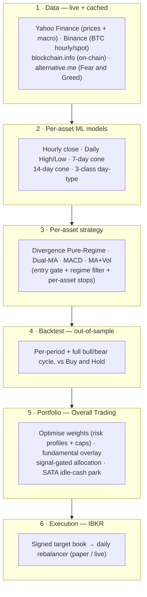
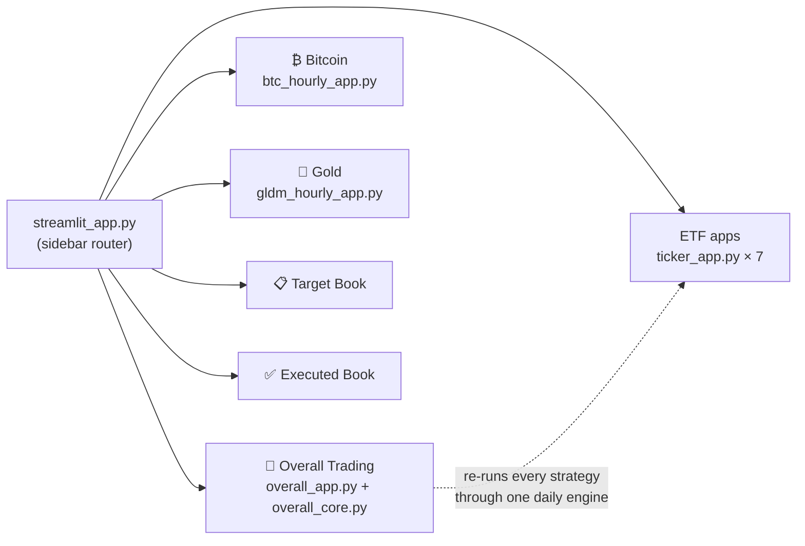
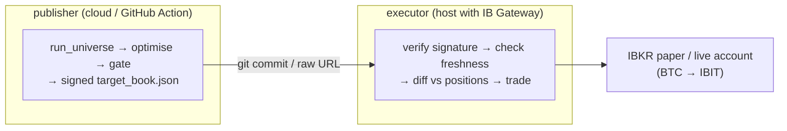

# 🧭 Multi-Asset Quant Trading Platform

A research-to-execution trading application: it **forecasts** a universe of
assets with per-asset ML models, derives a **trend/divergence trading strategy**
for each, **backtests** them out-of-sample, blends them into one **risk-managed
portfolio**, and can **execute** that portfolio on Interactive Brokers.

Everything is served through a single **Streamlit dashboard** (pick an app from
the sidebar radio) and, optionally, a headless daily **IBKR rebalancer**.

> **Origin.** This repo began as a Bitcoin range forecaster (hence the
> `btc-range-model` name and the deep BTC model stack in
> **[`BTC_README.md`](BTC_README.md)**). It has since grown into a full
> multi-asset platform — nine signal apps, a combined portfolio cockpit, and a
> live IBKR execution path.

```bash
pip install -r requirements.txt
streamlit run streamlit_app.py     # root router → pick any app in the sidebar
```

---

## What's inside — the apps

`streamlit_app.py` is a router; one sidebar **Application** radio switches
between every app below. Each app is self-contained but shares the same data,
model and backtest machinery.

| App | Module | What it does |
|---|---|---|
| 🧭 **Overall Trading** | `app/overall_app.py` | The combined cross-asset **decision cockpit** — fuses every signal, position and backtest into one portfolio and answers *"where should capital go today?"* |
| ₿ **Bitcoin (BTC)** | `app/btc_hourly_app.py` | Four-model BTC forecaster (hourly close, daily H/L, 7-day cone, day-type) + the BTC divergence strategy (BTC · MSTR · MSTU). See **[`BTC_README.md`](BTC_README.md)**. |
| 🥇 **Gold (GLDM)** | `app/gldm_hourly_app.py` | Gold forecaster + gold-scaled divergence strategy (GLDM · GDX · UGL · NUGT). See **[`GLDM_README.md`](GLDM_README.md)**. |
| 🖥️ **SOXX** · ⚡ **GRID** · 🛢️ **XLE** · 🧲 **REMX** · ⛏️ **WGMI** · ☀️ **PBW** · 🤖 **ARTY** | `app/ticker_app.py` | Seven config-driven ETF apps — one engine, one `TickerConfig` per asset. See **[`TICKER_APPS_README.md`](TICKER_APPS_README.md)**. |
| 📋 **Target Book (IBKR)** | `app/target_book_app.py` | Human-readable viewer for the signed target-allocation artifact the rebalancer trades. |
| ✅ **Executed Book (IBKR)** | `app/executed_book_app.py` | Post-rebalance report: trades executed + current IBKR positions vs target. |

Each **signal app** produces **one** signal but may trade several instruments
off it — its 1× primary plus higher-beta / leveraged siblings, exactly as a desk
would trade a view through proxies:

| Signal | 1× primary | Higher-beta / leveraged siblings |
|---|---|---|
| BTC | BTC | MSTR (proxy) · MSTU (2×) |
| Gold | GLDM | GDX (miners) · UGL (2×) · NUGT (2× miners) |
| Energy | XLE | OIH (oil services) · ERX (2×) |
| Semis | SOXX | SOXL (3×) |
| Grid · Rare-earth · Miners · Clean-energy · AI/Tech | GRID · REMX · WGMI · PBW · ARTY | — |

---

## Application architecture

Six stages turn raw market data into an executable book. Everything runs inside
the Streamlit process (no separate inference service); the IBKR path is the only
piece that leaves the box.



**Routing & UI layer**



The **Overall** app never imports the individual apps — it re-runs every
instrument through one unified daily engine (`overall_core` → `ticker_core` +
`backtest_ticker`, with BTC/Gold via their own CT/gold engines) so all
strategies are directly comparable and blendable.

---

## Trading strategy

Two engines cover the whole universe; the strategy and its thresholds are
**tuned per asset** (never assumed) by a frontier sweep, and validated
out-of-sample over multiple periods **and** the full bull+bear cycle.

- **Divergence Pure-Regime** (BTC, Gold, XLE, PBW, ARTY) — enter on a bullish
  H/L-forecast divergence (U1) confirmed inside a trend-regime gate; exit on
  momentum-fade / exhaustion (D2/D3) or a fixed stop.
- **Trend filters** (SOXX dual-MA 25/100 · GRID MACD 10/20/9 · REMX dual-MA
  50/200 golden cross · WGMI 50-day SMA + volatility filter) — long only while
  the trend holds, flat otherwise.

**Common rules across every app:**

- The signal is executed in **higher-beta / leveraged proxies**, not always the
  1× underlying (BTC→MSTR/MSTU, Gold→GDX/UGL, XLE→OIH/ERX, SOXX→SOXL).
- Strategies are **long/flat** — when flat, idle capital is parked in **SATA**
  (a ~13 %-yield preferred), not dead cash.
- **Portfolio blend (Overall):** a Monte-Carlo optimiser searches long-only
  weights (per-kind caps: 30 % core / 18 % beta / 10 % leveraged) for three
  **risk profiles** — Balanced (max Sharpe), Growth (−22 % DD budget),
  Aggressive (−38 % budget) — with an optional mid-2026 **fundamental overlay**.

Full specs: **[`TRADING_STRATEGY.md`](TRADING_STRATEGY.md)** (BTC/MSTR/MSTU),
**[`GLDM_TRADING_STRATEGY.md`](GLDM_TRADING_STRATEGY.md)** (gold),
**[`TREND_SIGNATURES.md`](TREND_SIGNATURES.md)** (the divergence signatures).

---

## Methodology

- **Anti-leakage training.** Strict chronological **train / val / test** splits
  with a per-horizon **embargo**; all hyperparameters chosen on val with test
  untouched until final reporting (see **[`BTC_README.md`](BTC_README.md) §
  Leakage audit**).
- **Genuinely out-of-sample backtests.** Each signal model is fit once on a
  pre-OOS window; every reported return stream starts after that cutoff. Strategy
  thresholds are chosen on a held-out window, not the reporting window.
- **Honest framing.** Intraday direction is ~coin-flip for *every* asset — the
  forecasters' value is a tight, well-calibrated **volatility cone**, not a
  directional bet. The tradable edge lives in the **trend regime** and **risk
  control**, which the backtests quantify.
- **Reproducible & lightweight.** Models are ridge / logistic / shallow-GBM so
  they retrain in seconds; committed `data/<key>/` snapshots let every backtest
  run offline with `--cached`.

Deep-dives: **[`OVERALL_OOS_WALKFORWARD_EVAL.md`](OVERALL_OOS_WALKFORWARD_EVAL.md)**,
**[`HYPERPARAM_SEARCH_EVAL.md`](HYPERPARAM_SEARCH_EVAL.md)**,
**[`ML_STATISTICAL_STRATEGY_EVAL.md`](ML_STATISTICAL_STRATEGY_EVAL.md)**,
**[`REGIME_DIVERGENCE_EVAL.md`](REGIME_DIVERGENCE_EVAL.md)**.

---

## Results summary

**Out-of-sample (2021→now unless noted), strategy vs Buy & Hold.** Every app
beats B&H on **drawdown and Sharpe**; the commodity-crash assets also beat it on
raw return.

| Signal | Strategy | Strat return | B&H return | Strat MDD | B&H MDD | Sharpe (S / B&H) |
|---|---|---:|---:|---:|---:|---:|
| SOXX | Dual-MA 25/100, −5 % stop | **+452 %** | +362 % | **−27 %** | −46 % | **1.23 / 0.94** |
| GRID | MACD 10/20/9, −5 % stop | **+134 %** | +132 % | **−16 %** | −30 % | **1.20 / 0.83** |
| XLE | Energy divergence | +105 % | +180 % | **−9 %** | −27 % | **1.37 / 0.84** |
| REMX | Dual-MA 50/200 golden cross | **+135 %** | +24 % | **−27 %** | −74 % | **0.68 / 0.30** |
| WGMI | MA-50 + vol-filter | **+376 %** | +223 % | **−32 %** | −63 % | **1.81 / 0.98** |
| Gold (GDX) | Divergence Pure-Regime | **+270 %** | — | **−16 %** | −47 % | **1.40** |
| Gold (UGL 2×) | Divergence Pure-Regime | **+207 %** | — | **−18 %** | −49 % | **1.29** |

The **Overall** portfolio blends these into one book; the Aggressive profile
roughly doubles Balanced's return by loading the leveraged sleeves within its
drawdown budget. Full per-period and full-cycle tables live in each app's
Backtesting tab and in **[`TICKER_APPS_README.md`](TICKER_APPS_README.md)**,
**[`SOXL_ERX_ADDITION_EVAL.md`](SOXL_ERX_ADDITION_EVAL.md)**, and
**[`LEV_SIBLINGS_STOP_EVAL.md`](LEV_SIBLINGS_STOP_EVAL.md)**.

> **Read honestly.** On secular compounders (SOXX, GRID, WGMI) an unleveraged
> long/flat rule *cannot* beat B&H on total return — it wins on **risk-adjusted**
> terms (higher Sharpe, ~half the drawdown). On assets that rode a multi-year
> bear all the way down (XLE, OIH, REMX) it beats B&H outright.

---

## Quick start

```bash
pip install -r requirements.txt

# 1 · Launch the dashboard (all apps, one sidebar radio)
streamlit run streamlit_app.py

# 2 · Retrain models (each writes to models/<key>/*.joblib)
python src/pipeline_ct.py                 # BTC daily H/L  → models/inference_assets_ct.joblib
python src/train_7d_close_cone.py         # BTC 7-day cone
python src/train_3class_day_type.py       # BTC day-type
python src/train_hourly_model.py          # BTC hourly close
python src/gldm/train_gldm.py             # Gold — all 5 models
python src/tickers/train_ticker.py ALL    # SOXX/GRID/XLE/REMX/WGMI/PBW/ARTY

# 3 · Backtest / sweep (add --cached to use committed data/<key> snapshots)
python backtest_ticker.py SOXX --sweep    # per-asset strategy/threshold frontier
python backtest_gldm.py --sweep           # gold backtest + sweep

# 4 · Execute on IBKR paper (see IBKR_PAPER_TRADING.md first)
python scripts/ibkr_rebalance.py                 # dry-run preview
python scripts/ibkr_rebalance.py --execute       # trade the paper account
```

Every script and app resolves file paths from `paths.py` (the single source of
truth). Deploy target is **Python 3.12** (see `requirements.txt` header).

---

## Live execution (Interactive Brokers)

The Overall book can drive a real IBKR account. Two topologies, both
**paper-by-default** with a `DU`-account guard and dry-run default:

- **A — all-in-one** (`scripts/ibkr_rebalance.py`): the model and execution run
  on the same host.
- **C — publish/execute**: a cloud **publisher** (`scripts/publish_target_book.py`,
  or the GitHub Action) emits a **signed** `target_book.json`; a lightweight
  **executor** (`scripts/ibkr_execute_book.py`) next to IB Gateway verifies and
  trades it — the trading host never runs the model.



Guides: **[`IBKR_PAPER_TRADING.md`](IBKR_PAPER_TRADING.md)** (setup + both
topologies) · **[`IBKR_OPTION_C_WINDOWS.md`](IBKR_OPTION_C_WINDOWS.md)** (Windows)
· **[`docs/CLOUD_EXECUTOR.md`](docs/CLOUD_EXECUTOR.md)** (headless Docker gateway
on a free VM) · **[`docs/LIVE_TRADING.md`](docs/LIVE_TRADING.md)** (real-money
mode + guards) · **[`docs/option_c_architecture.md`](docs/option_c_architecture.md)**
(full architecture diagram).

---

## Repository structure

```
├── streamlit_app.py          Root router — one sidebar radio for every app
├── paths.py                  Single source of truth for all file paths
├── requirements.txt          Runtime deps (deploy on Python 3.12)
├── requirements-ibkr.txt     Broker layer (ib_async) — executor host only
│
├── app/                      Streamlit apps + shared engines
│   ├── overall_app.py / overall_core.py     🧭 combined portfolio cockpit
│   ├── btc_hourly_app.py / btc_ct_engine.py ₿ Bitcoin forecaster + engine
│   ├── gldm_hourly_app.py / gldm_core.py    🥇 Gold forecaster
│   ├── ticker_app.py / ticker_core.py / ticker_config.py   7 ETF apps (one engine)
│   ├── target_book_app.py / target_book.py  📋 target-allocation viewer
│   └── executed_book_app.py / executed_book.py  ✅ post-rebalance report
│
├── src/                      Training & data-fetch code
│   ├── pipeline_ct.py, train_hourly_model.py, train_7d_close_cone.py,
│   │   train_3class_day_type.py, train_14d_close_cone.py   BTC models
│   ├── gldm/train_gldm.py                    Gold — 5 models
│   └── tickers/train_ticker.py               ETF apps — 5 models each
│
├── backtest_*.py             Backtest engines (per-asset sweeps, stop-loss,
│                             re-entry, monthly profile, significance tests …)
├── scripts/                  IBKR execution + publishing, evals, data pulls
│   ├── ibkr_rebalance.py, publish_target_book.py, ibkr_execute_book.py,
│   │   ibkr_common.py, ibkr_symbols.py, ibkr_daily.sh / .ps1
│   ├── pull_backtest_data.py, fetch_macro_hourly_cache.py
│   └── eval_*.py, build_overall.py           strategy-evaluation harnesses
│
├── models/<key>/*.joblib     Trained artefacts per asset (btc root, gldm, soxx, …)
├── data/<key>/*.csv|json     Cached snapshots + committed backtest results
├── deploy/                   IBC config, systemd units, Dockerised IB Gateway
├── docs/                     Cloud executor, live trading, architecture diagrams
├── notebooks/                BTC inference / training walk-throughs
├── tests/                    Lightweight smoke tests for external data feeds
└── legacy/                   Superseded UTC-midnight BTC pipeline (audit only)
```

---

## Documentation map

| Topic | Doc |
|---|---|
| Bitcoin four-model stack (deep dive) | [`BTC_README.md`](BTC_README.md) |
| BTC / MSTR / MSTU strategy spec | [`TRADING_STRATEGY.md`](TRADING_STRATEGY.md) · [`BTC_MSTR_MSTU_STRATEGY_EVAL.md`](BTC_MSTR_MSTU_STRATEGY_EVAL.md) |
| Divergence trend signatures | [`TREND_SIGNATURES.md`](TREND_SIGNATURES.md) |
| Gold app + strategy | [`GLDM_README.md`](GLDM_README.md) · [`GLDM_TRADING_STRATEGY.md`](GLDM_TRADING_STRATEGY.md) |
| ETF apps (SOXX/GRID/XLE/REMX/WGMI/PBW/ARTY) | [`TICKER_APPS_README.md`](TICKER_APPS_README.md) |
| Per-asset strategy evaluations | [`HYPERPARAM_SEARCH_EVAL.md`](HYPERPARAM_SEARCH_EVAL.md) · [`ML_STATISTICAL_STRATEGY_EVAL.md`](ML_STATISTICAL_STRATEGY_EVAL.md) · [`REGIME_DIVERGENCE_EVAL.md`](REGIME_DIVERGENCE_EVAL.md) · [`SOXL_ERX_ADDITION_EVAL.md`](SOXL_ERX_ADDITION_EVAL.md) · [`LEV_SIBLINGS_STOP_EVAL.md`](LEV_SIBLINGS_STOP_EVAL.md) |
| Combined portfolio walk-forward | [`OVERALL_OOS_WALKFORWARD_EVAL.md`](OVERALL_OOS_WALKFORWARD_EVAL.md) |
| IBKR execution | [`IBKR_PAPER_TRADING.md`](IBKR_PAPER_TRADING.md) · [`IBKR_OPTION_C_WINDOWS.md`](IBKR_OPTION_C_WINDOWS.md) · [`docs/CLOUD_EXECUTOR.md`](docs/CLOUD_EXECUTOR.md) · [`docs/LIVE_TRADING.md`](docs/LIVE_TRADING.md) |
| Legacy (audit only) | [`legacy/README.md`](legacy/README.md) |

> **Honest bottom line.** This is a research and paper-trading platform for
> studying signal-driven, risk-managed strategies. Backtests are out-of-sample
> but not a promise of future returns; going to real money is a separate,
> deliberate decision (see [`docs/LIVE_TRADING.md`](docs/LIVE_TRADING.md)).
