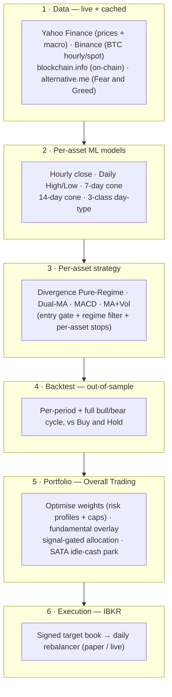
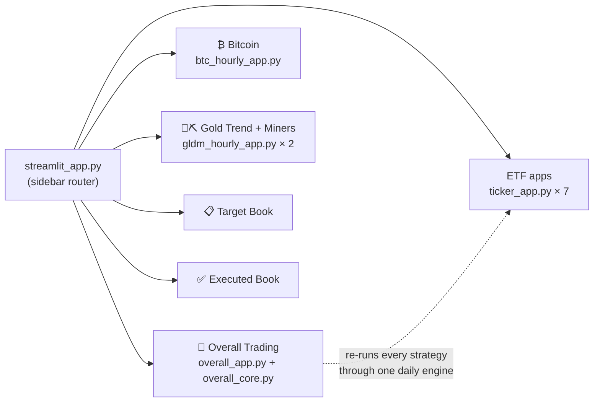
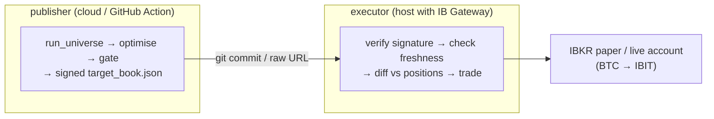

# 🧭 Multi-Asset Quant Trading Platform

A research-to-execution trading application: it **forecasts** a universe of
assets with per-asset ML models, derives a **trend/divergence trading strategy**
for each, **backtests** them out-of-sample, blends them into one **risk-managed
portfolio**, and can **execute** that portfolio on Interactive Brokers.

Everything is served through a single **Streamlit dashboard** (pick an app from
the sidebar radio) and, optionally, a headless daily **IBKR rebalancer**.

> **Origin.** This repo began as a Bitcoin range forecaster (hence the
> `btc-range-model` name and the deep BTC model stack in
> **[`BTC_README.md`](BTC_README.md)**). It has since grown into a full
> multi-asset platform — ten signal apps, a combined portfolio cockpit, and a
> live IBKR execution path.

```bash
pip install -r requirements.txt
streamlit run streamlit_app.py     # root router → pick any app in the sidebar
```

**Contents:** [Apps](#whats-inside--the-apps) · [Architecture](#application-architecture) · [Strategy](#trading-strategy) · [Methodology](#methodology) · [Results](#results-summary) · [Quick start](#quick-start) · [Live execution](#live-execution-interactive-brokers) · [Repo structure](#repository-structure) · [Docs map](#documentation-map)

---

## What's inside — the apps

`streamlit_app.py` is a router; one sidebar **Application** radio switches
between every app below. Each app is self-contained but shares the same data,
model and backtest machinery.

| App | Module | What it does |
|---|---|---|
| 🧭 **Overall Trading** | `app/overall_app.py` | The combined cross-asset **decision cockpit** — fuses every signal, position and backtest into one portfolio and answers *"where should capital go today?"* |
| ₿ **Bitcoin (BTC)** | `app/btc_hourly_app.py` | Four-model BTC forecaster (hourly close, daily H/L, 7-day cone, day-type) + the BTC divergence strategy (BTC · MSTR · MSTU). See **[`BTC_README.md`](BTC_README.md)**. |
| 🥇 **Gold Trend (GLDM)** | `app/gldm_hourly_app.py` | Gold forecaster + dual-MA 25/100 strategy (GLDM · UGL). See **[`GLDM_README.md`](GLDM_README.md)**. |
| ⛏️ **Gold Miners (GDXM)** | `app/gldm_hourly_app.py` | Gold-miners divergence strategy off the GLDM signal (GDX · NUGT) — same file, second app mode. |
| 🖥️ **SOXX** · ⚡ **GRID** · 🛢️ **XLE** · 🧲 **REMX** · ⛏️ **WGMI** · ☀️ **PBW** · 🤖 **ARTY** | `app/ticker_app.py` | Seven config-driven ETF apps — one engine, one `TickerConfig` per asset. See **[`TICKER_APPS_README.md`](TICKER_APPS_README.md)**. |
| 📋 **Target Book (IBKR)** | `app/target_book_app.py` | Human-readable viewer for the signed target-allocation artifact the rebalancer trades. |
| ✅ **Executed Book (IBKR)** | `app/executed_book_app.py` | Post-rebalance report: trades executed + current IBKR positions vs target. |

Each **signal app** produces **one** signal but may trade several instruments
off it — its 1× primary plus higher-beta / leveraged siblings, exactly as a desk
would trade a view through proxies:

| Signal | 1× primary | Higher-beta / leveraged siblings |
|---|---|---|
| BTC | BTC | MSTR (proxy) · MSTU (2×) |
| Gold Trend | GLDM | UGL (2×) |
| Gold Miners (GLDM signal) | GDX | NUGT (2× miners) |
| Energy | XLE | OIH (oil services) · ERX (2×) |
| Semis | SOXX | SOXL (3×) |
| Grid · Rare-earth · Miners · Clean-energy · AI/Tech | GRID · REMX · WGMI · PBW · ARTY | — |

---

## Application architecture

Six stages turn raw market data into an executable book. Everything runs inside
the Streamlit process (no separate inference service); the IBKR path is the only
piece that leaves the box.



**Routing & UI layer**



The **Overall** app never imports the individual apps — it re-runs every
instrument through one unified daily engine (`overall_core` → `ticker_core` +
`backtest_ticker`, with BTC/Gold via their own CT/gold engines) so all
strategies are directly comparable and blendable.

---

## Trading strategy

Two engines cover the whole universe; the strategy and its thresholds are
**tuned per asset** (never assumed) by a frontier sweep, and validated
out-of-sample over multiple periods **and** the full bull+bear cycle.

- **Divergence Pure-Regime** (BTC, Gold Miners, PBW, ARTY) — enter on a bullish
  H/L-forecast divergence (U1) confirmed inside a trend-regime gate; exit on
  momentum-fade / exhaustion (D2/D3) or a fixed stop.
- **Trend filters** (SOXX & Gold Trend dual-MA 25/100 · GRID MACD 10/20/9 ·
  REMX dual-MA 50/200 golden cross · WGMI 50-day SMA + volatility filter) —
  long only while the trend holds, flat otherwise.
- **Crash-shield quasi-B&H** (XLE · OIH · ERX) — long by default; exit only
  while the close sits >30 % below its 52-week high, re-enter above the
  50-day SMA.

**Common rules across every app:**

- The signal is executed in **higher-beta / leveraged proxies**, not always the
  1× underlying (BTC→MSTR/MSTU/ETHA, Gold→UGL & GDX/NUGT, XLE→OIH/ERX, SOXX→SOXL).
- Strategies are **long/flat** — when flat, idle capital is parked in **SATA**
  (a ~13 %-yield preferred), not dead cash.
- **Portfolio blend (Overall):** a Monte-Carlo optimiser searches long-only
  weights (per-kind caps: 30 % core / 18 % beta / 10 % leveraged) for three
  **risk profiles** — Balanced (max Sharpe), Growth (−22 % DD budget),
  Aggressive (−38 % budget) — with an optional mid-2026 **fundamental overlay**.
  Today's book is then **signal-gated** and **priority-tilted**, with the
  undeployed remainder parked in SATA. Full mechanics (universe, optimiser,
  priority score, allocation) in **[`OVERALL_STRATEGY.md`](OVERALL_STRATEGY.md)**.

### Strategy docs

Each row leads with the **current strategy doc** for that asset; the
evaluation / experiment docs behind it are grouped under *Additional docs*. The
**Overall** book combines them all.

| Strategy | Signal(s) | Current strategy doc → additional |
|---|---|---|
| BTC Divergence Pure-Regime | BTC · MSTR · MSTU · ETHA (Overall sleeve) | **[`TRADING_STRATEGY.md`](TRADING_STRATEGY.md)** — current live spec<br>_Additional docs:_ [`BTC_MSTR_MSTU_STRATEGY_EVAL.md`](BTC_MSTR_MSTU_STRATEGY_EVAL.md) · [`ETHA_BMNR_STRATEGY_EVAL.md`](ETHA_BMNR_STRATEGY_EVAL.md) (ETHA add) · [`TREND_SIGNATURES.md`](TREND_SIGNATURES.md) · [`LEV_SIBLINGS_STOP_EVAL.md`](LEV_SIBLINGS_STOP_EVAL.md) (MSTU stop) |
| Gold middle path (dual-MA + divergence) | GLDM · UGL & GDX · NUGT | **[`GLDM_TRADING_STRATEGY.md`](GLDM_TRADING_STRATEGY.md)** — current live spec<br>_Additional docs:_ [`GLDM_README.md`](GLDM_README.md) · [`LEV_SIBLINGS_STOP_EVAL.md`](LEV_SIBLINGS_STOP_EVAL.md) (UGL/NUGT stops) |
| Semis Dual-MA 25/100 | SOXX · SOXL | **[`TICKER_APPS_README.md`](TICKER_APPS_README.md)** — current strategy<br>_Additional docs:_ [`HYPERPARAM_SEARCH_EVAL.md`](HYPERPARAM_SEARCH_EVAL.md) · [`ML_STATISTICAL_STRATEGY_EVAL.md`](ML_STATISTICAL_STRATEGY_EVAL.md) · [`SOXX_STOP_EVAL.md`](SOXX_STOP_EVAL.md) · [`SOXL_STOP_EVAL.md`](SOXL_STOP_EVAL.md) · [`SOXL_ERX_ADDITION_EVAL.md`](SOXL_ERX_ADDITION_EVAL.md) |
| Grid MACD 10/20/9 | GRID | **[`TICKER_APPS_README.md`](TICKER_APPS_README.md)** — current strategy<br>_Additional docs:_ [`HYPERPARAM_SEARCH_EVAL.md`](HYPERPARAM_SEARCH_EVAL.md) · [`ML_STATISTICAL_STRATEGY_EVAL.md`](ML_STATISTICAL_STRATEGY_EVAL.md) |
| Energy Divergence Pure-Regime | XLE · OIH · ERX | **[`TICKER_APPS_README.md`](TICKER_APPS_README.md)** — current strategy<br>_Additional docs:_ [`REGIME_DIVERGENCE_EVAL.md`](REGIME_DIVERGENCE_EVAL.md) · [`SOXL_ERX_ADDITION_EVAL.md`](SOXL_ERX_ADDITION_EVAL.md) (ERX) |
| Metals Dual-MA 50/200 golden cross | REMX | **[`TICKER_APPS_README.md`](TICKER_APPS_README.md)** — current strategy<br>_Additional docs:_ [`REGIME_DIVERGENCE_EVAL.md`](REGIME_DIVERGENCE_EVAL.md) · [`ML_STATISTICAL_STRATEGY_EVAL.md`](ML_STATISTICAL_STRATEGY_EVAL.md) |
| Miner MA-50 + volatility filter | WGMI | **[`TICKER_APPS_README.md`](TICKER_APPS_README.md)** — current strategy<br>_Additional docs:_ [`HYPERPARAM_SEARCH_EVAL.md`](HYPERPARAM_SEARCH_EVAL.md) · [`ML_STATISTICAL_STRATEGY_EVAL.md`](ML_STATISTICAL_STRATEGY_EVAL.md) |
| Clean-energy / AI-Tech Divergence | PBW · ARTY | **[`TICKER_APPS_README.md`](TICKER_APPS_README.md)** — current strategy |
| **Overall combined portfolio** | **all of the above** | **[`OVERALL_STRATEGY.md`](OVERALL_STRATEGY.md)** — how it works (universe, optimiser, priority, allocation)<br>_Additional docs:_ [`OVERALL_OOS_WALKFORWARD_EVAL.md`](OVERALL_OOS_WALKFORWARD_EVAL.md) (walk-forward) · [`VEGN_REMOVAL_EVAL.md`](VEGN_REMOVAL_EVAL.md) (composition) |

All seven ETF apps share one config-driven engine — see
[`TICKER_APPS_README.md`](TICKER_APPS_README.md).

---

## Methodology

- **Anti-leakage training.** Strict chronological **train / val / test** splits
  with a per-horizon **embargo**; all hyperparameters chosen on val with test
  untouched until final reporting (see **[`BTC_README.md`](BTC_README.md) §
  Leakage audit**).
- **Genuinely out-of-sample backtests.** Each signal model is fit once on a
  pre-OOS window; every reported return stream starts after that cutoff. Strategy
  thresholds are chosen on a held-out window, not the reporting window.
- **Honest framing.** Intraday direction is ~coin-flip for *every* asset — the
  forecasters' value is a tight, well-calibrated **volatility cone**, not a
  directional bet. The tradable edge lives in the **trend regime** and **risk
  control**, which the backtests quantify.
- **Reproducible & lightweight.** Models are ridge / logistic / shallow-GBM so
  they retrain in seconds; committed `data/<key>/` snapshots let every backtest
  run offline with `--cached`.

Deep-dives: **[`OVERALL_OOS_WALKFORWARD_EVAL.md`](OVERALL_OOS_WALKFORWARD_EVAL.md)**,
**[`HYPERPARAM_SEARCH_EVAL.md`](HYPERPARAM_SEARCH_EVAL.md)**,
**[`ML_STATISTICAL_STRATEGY_EVAL.md`](ML_STATISTICAL_STRATEGY_EVAL.md)**,
**[`REGIME_DIVERGENCE_EVAL.md`](REGIME_DIVERGENCE_EVAL.md)**.

---

## Results summary

Read the numbers with two things in mind: the **backtest window differs by
asset** (each return stream starts at that instrument's usable history), and a
rule that sits in cash during crashes is *expected* to beat Buy & Hold on
drawdown — the harder tests are **Sharpe** and whether it can beat B&H on
**return** at all.

**ETF & Gold — out-of-sample 2021 → now, strategy vs Buy & Hold.**

> **2026-07 causal-H/L revision.** The daily High/Low model behind every
> *divergence* strategy (Gold, XLE, PBW, ARTY) previously leaked the target
> bar's own features into its "forecast"; it is now causal and all divergence
> thresholds were re-tuned on the honest error (`GLDM_TRADING_STRATEGY.md`).
> Divergence rows below changed materially as a result; trend rows (dual-MA /
> MACD / ma_vol) only drifted with the data refresh. XLE subsequently moved to
> a **crash-shield quasi-buy-&-hold** (long by default; exit only >30 % below
> the 52-week high; re-enter above the 50-day SMA): on the honest signal no
> fitted overlay could keep up with the energy bull, and the shield matches
> B&H out-of-sample while beating it on return, drawdown and Sharpe over the
> full 2015→now cycle.

| Signal | Strategy | Strat return | B&H return | Strat MDD | B&H MDD | Sharpe (S / B&H) |
|---|---|---:|---:|---:|---:|---:|
| SOXX | Dual-MA 25/100, −5 % stop | **+425 %** | +340 % | **−27 %** | −46 % | **1.18 / 0.91** |
| GRID | MACD 10/20/9, −5 % stop | **+134 %** | +124 % | **−16 %** | −30 % | **1.19 / 0.79** |
| XLE | Crash-shield quasi-B&H (30 % / SMA50) | +198 % | +207 % | −27 % | −27 % | 0.89 / 0.90 |
| REMX | Dual-MA 50/200 golden cross | **+98 %** | +5 % | **−36 %** | −74 % | **0.56 / 0.23** |
| WGMI | MA-50 + vol-filter | **+376 %** | +223 % | **−32 %** | −63 % | **1.80 / 0.97** |
| PBW | Clean-energy divergence | **+148 %** | −67 % | **−30 %** | −90 % | **0.97 / −0.23** |
| ARTY | AI/Tech divergence | **+148 %** | +73 % | **−27 %** | −56 % | **1.11 / 0.48** |
| Gold (GLDM 1× core) | Dual-MA 25/100 (hybrid) | **+137 %** | +108 % | **−19 %** | −26 % | **1.08 / 0.83** |
| Gold (UGL 2×) | Dual-MA 25/100 (hybrid) | **+302 %** | +151 % | **−38 %** | −50 % | **0.96 / 0.64** |
| Gold (GDX β) | Divergence Pure-Regime | **+103 %** | +92 % | **−22 %** | −46 % | **0.85 / 0.51** |
| Gold (NUGT 2×) | Divergence Pure-Regime | **+276 %** | +41 % | **−38 %** | −74 % | **0.90 / 0.45** |

**BTC · MSTR · MSTU — deployed CT-divergence (ML) engine, full 2024-03 → 2026-07
round-trip (~2.4 yr, one bull→bear).** The Bitcoin signal drives all three
sleeves; MSTR/MSTU are traded off the **BTC parent** trend. Stops are the current
**2026-07e vol-matched** config — **BTC & MSTR signal-exit-only (no fixed stop)**,
**MSTU −6 %** — matching the live figures in
[`TRADING_STRATEGY.md`](TRADING_STRATEGY.md).

| Asset | Strat return | B&H return | Strat MDD | B&H MDD | Sharpe (S / B&H) |
|---|---:|---:|---:|---:|---:|
| BTC (core) | **+86 %** | −7 % | **−28 %** | −53 % | **1.05 / 0.14** |
| MSTR (β) | **+266 %** | −12 % | **−22 %** | −83 % | **1.41 / 0.38** |
| MSTU (2×) | **+524 %** | −94 % | **−42 %** | −99 % | **1.27 / 0.19** |

Buy & hold is flat-to-catastrophic over this window (MSTU's 2× decay ≈ total
wipeout); the strategy stays long in the bull, steps aside in the bear, and even
posts *positive* bear-market returns on MSTR/MSTU. The **Overall** portfolio
blends every sleeve above into one book — with the 2026-07 revised sleeves the
combined OOS 2021→now backtest lands at **Balanced +852 % (−13 % MDD, Sharpe
2.48) · Growth +1,893 % (−23 %, 1.71) · Aggressive +2,387 % (−31 %, 1.54)**,
the higher profiles loading the leveraged sleeves within their drawdown budgets.

> **Which numbers are these?** The current live **2026-07e** stop config (MSTR
> stop-free, MSTU −6 %). An earlier snapshot with a flat −3 % stop on both
> leveraged names — reported in
> [`BTC_MSTR_MSTU_STRATEGY_EVAL.md`](BTC_MSTR_MSTU_STRATEGY_EVAL.md) — shows MSTR
> ≈ +270 % (Sharpe 1.34) and MSTU ≈ +469 % (Sharpe 1.12, MDD −48 %); the
> vol-matched retune is what lifts them. Both are the same engine and window,
> only the per-asset stop differs.

Full analysis: **[`TRADING_STRATEGY.md`](TRADING_STRATEGY.md)** (live config),
**[`BTC_MSTR_MSTU_STRATEGY_EVAL.md`](BTC_MSTR_MSTU_STRATEGY_EVAL.md)** (robustness),
**[`LEV_SIBLINGS_STOP_EVAL.md`](LEV_SIBLINGS_STOP_EVAL.md)** (stop retune),
**[`TICKER_APPS_README.md`](TICKER_APPS_README.md)**,
**[`SOXL_ERX_ADDITION_EVAL.md`](SOXL_ERX_ADDITION_EVAL.md)**.

### Strengths of the methodology

- **The edge survives the tests that usually kill backtests.** The BTC/MSTR/MSTU
  rule holds up under 5-fold contiguous **cross-validation** (BTC-parent mean
  fold Sharpe 0.78–0.88, beats B&H in 4/5 folds), **walk-forward** with in-sample
  parameter selection (the picked SMA window barely moves — 30–40 every fold), a
  **real-tape cross-check** (the edge holds on the *non-synthetic* MSTU fund from
  2024-09, Sharpe ~1.2), a **bull/bear split**, and **cost sensitivity** (Sharpe
  holds to 50 bps/switch on the leveraged names).
- **Leakage-controlled training.** Strict chronological train/val/test splits
  with a per-horizon embargo; every hyperparameter is chosen on validation with
  the test slice untouched until final reporting.
- **Conservative accounting.** Simple-rule comparisons use **next-bar** fills and
  charge transaction costs per switch; each signal model is fit once on a pre-OOS
  window, so reported streams are genuinely out-of-sample.

### Limitations of the results

- **Windows differ and can be short.** The BTC/MSTR/MSTU figures span only ~2.4
  years — one bull→bear cycle, not many — because the CT engine's ML feature
  warm-up begins ~2024-03. A deep, *unrecovered* bear is exactly the setting where
  a long/flat rule can flatter itself against Buy & Hold on total return.
- **Some MSTU history is synthetic.** The long-window MSTU series is an
  **OLS-synthetic** reconstruction, cross-checked against the real fund only from
  2024-09-18 — the earlier leveraged path is modelled, not traded.
- **Execution optimism.** The deployed CT engine executes **same-bar** and stops
  **intrabar**, which modestly flatters it versus the conservative next-bar fills
  used for the comparison rules.
- **Daily-rebuild caveat.** The divergence thresholds are tuned for the app's
  **hourly** CT model; re-run daily inside the Overall engine the H/L predictions
  are noisier, so BTC/MSTR/MSTU earn ~0 weight in the *daily* blend — the
  alignment there is for signal consistency, not daily performance.
- **In-sample replay in the UI.** Picking a dashboard date inside a model's
  training window shows memorised fit, not a forecast (a warning banner flags it).
- **Compounders can't be beaten on return, unleveraged.** On secular compounders
  (SOXX, GRID, WGMI) a long/flat rule wins only on **risk-adjusted** terms (higher
  Sharpe, ~half the drawdown), never on raw return — every day in cash is missed
  upside. It beats B&H outright only on assets that rode a multi-year bear down
  (XLE, OIH, REMX; BTC/MSTR/MSTU in this window).
- **Backtests are not forward promises.** Past performance is not indicative of
  future results; real-money trading is a separate, deliberate decision.

---

## Quick start

```bash
pip install -r requirements.txt

# 1 · Launch the dashboard (all apps, one sidebar radio)
streamlit run streamlit_app.py

# 2 · Retrain models (each writes to models/<key>/*.joblib)
python src/pipeline_ct.py                 # BTC daily H/L  → models/inference_assets_ct.joblib
python src/train_7d_close_cone.py         # BTC 7-day cone
python src/train_3class_day_type.py       # BTC day-type
python src/train_hourly_model.py          # BTC hourly close
python src/gldm/train_gldm.py             # Gold — all 5 models
python src/tickers/train_ticker.py ALL    # SOXX/GRID/XLE/REMX/WGMI/PBW/ARTY

# 3 · Backtest / sweep (add --cached to use committed data/<key> snapshots)
python backtest_ticker.py SOXX --sweep    # per-asset strategy/threshold frontier
python backtest_gldm.py --sweep           # gold backtest + sweep

# 4 · Execute on IBKR paper (see IBKR_PAPER_TRADING.md first)
python scripts/ibkr_rebalance.py                 # dry-run preview
python scripts/ibkr_rebalance.py --execute       # trade the paper account
```

Every script and app resolves file paths from `paths.py` (the single source of
truth).

### Deploy the dashboard (Streamlit Community Cloud)

Host all apps for free on Streamlit Community Cloud — main file
`streamlit_app.py`, and you **must** pin **Python 3.12** in the deploy dialog
(`runtime.txt` is ignored by the platform and the default 3.14 crashes the ML
stack). Full walkthrough with prerequisites, screenshots of each field, and
troubleshooting: **[`docs/STREAMLIT_DEPLOY.md`](docs/STREAMLIT_DEPLOY.md)**.
Official platform docs: <https://docs.streamlit.io/deploy/streamlit-community-cloud>.

---

## Live execution (Interactive Brokers)

The Overall book can drive a real IBKR account. Two topologies, both
**paper-by-default** with a `DU`-account guard and dry-run default:

- **A — all-in-one** (`scripts/ibkr_rebalance.py`): the model and execution run
  on the same host.
- **C — publish/execute**: a cloud **publisher** (`scripts/publish_target_book.py`,
  or the GitHub Action) emits a **signed** `target_book.json`; a lightweight
  **executor** (`scripts/ibkr_execute_book.py`) next to IB Gateway verifies and
  trades it — the trading host never runs the model.



Guides: **[`IBKR_PAPER_TRADING.md`](IBKR_PAPER_TRADING.md)** (setup + both
topologies) · **[`IBKR_OPTION_C_WINDOWS.md`](IBKR_OPTION_C_WINDOWS.md)** (Windows)
· **[`docs/CLOUD_EXECUTOR.md`](docs/CLOUD_EXECUTOR.md)** (headless Docker gateway
on a free VM) · **[`docs/LIVE_TRADING.md`](docs/LIVE_TRADING.md)** (real-money
mode + guards) · **[`docs/option_c_architecture.md`](docs/option_c_architecture.md)**
(full architecture diagram).

---

## Repository structure

```
├── streamlit_app.py          Root router — one sidebar radio for every app
├── paths.py                  Single source of truth for all file paths
├── requirements.txt          Runtime deps (deploy on Python 3.12)
├── requirements-ibkr.txt     Broker layer (ib_async) — executor host only
│
├── app/                      Streamlit apps + shared engines
│   ├── overall_app.py / overall_core.py     🧭 combined portfolio cockpit
│   ├── btc_hourly_app.py / btc_ct_engine.py ₿ Bitcoin forecaster + engine
│   ├── gldm_hourly_app.py / gldm_core.py    🥇 Gold forecaster
│   ├── ticker_app.py / ticker_core.py / ticker_config.py   7 ETF apps (one engine)
│   ├── target_book_app.py / target_book.py  📋 target-allocation viewer
│   └── executed_book_app.py / executed_book.py  ✅ post-rebalance report
│
├── src/                      Training & data-fetch code
│   ├── pipeline_ct.py, train_hourly_model.py, train_7d_close_cone.py,
│   │   train_3class_day_type.py, train_14d_close_cone.py   BTC models
│   ├── gldm/train_gldm.py                    Gold — 5 models
│   └── tickers/train_ticker.py               ETF apps — 5 models each
│
├── backtest_*.py             Backtest engines (per-asset sweeps, stop-loss,
│                             re-entry, monthly profile, significance tests …)
├── scripts/                  IBKR execution + publishing, evals, data pulls
│   ├── ibkr_rebalance.py, publish_target_book.py, ibkr_execute_book.py,
│   │   ibkr_common.py, ibkr_symbols.py, ibkr_daily.sh / .ps1
│   ├── pull_backtest_data.py, fetch_macro_hourly_cache.py
│   └── eval_*.py, build_overall.py           strategy-evaluation harnesses
│
├── models/<key>/*.joblib     Trained artefacts per asset (btc root, gldm, soxx, …)
├── data/<key>/*.csv|json     Cached snapshots + committed backtest results
├── deploy/                   IBC config, systemd units, Dockerised IB Gateway
├── docs/                     Cloud executor, live trading, architecture diagrams
├── notebooks/                BTC inference / training walk-throughs
├── tests/                    Lightweight smoke tests for external data feeds
└── legacy/                   Superseded UTC-midnight BTC pipeline (audit only)
```

---

## Documentation map

| Topic | Doc |
|---|---|
| Bitcoin four-model stack (deep dive) | [`BTC_README.md`](BTC_README.md) |
| BTC / MSTR / MSTU strategy spec | [`TRADING_STRATEGY.md`](TRADING_STRATEGY.md) · [`BTC_MSTR_MSTU_STRATEGY_EVAL.md`](BTC_MSTR_MSTU_STRATEGY_EVAL.md) |
| Divergence trend signatures | [`TREND_SIGNATURES.md`](TREND_SIGNATURES.md) |
| Gold app + strategy | [`GLDM_README.md`](GLDM_README.md) · [`GLDM_TRADING_STRATEGY.md`](GLDM_TRADING_STRATEGY.md) |
| ETF apps (SOXX/GRID/XLE/REMX/WGMI/PBW/ARTY) | [`TICKER_APPS_README.md`](TICKER_APPS_README.md) |
| Per-asset strategy evaluations | [`HYPERPARAM_SEARCH_EVAL.md`](HYPERPARAM_SEARCH_EVAL.md) · [`ML_STATISTICAL_STRATEGY_EVAL.md`](ML_STATISTICAL_STRATEGY_EVAL.md) · [`REGIME_DIVERGENCE_EVAL.md`](REGIME_DIVERGENCE_EVAL.md) · [`SOXL_ERX_ADDITION_EVAL.md`](SOXL_ERX_ADDITION_EVAL.md) · [`LEV_SIBLINGS_STOP_EVAL.md`](LEV_SIBLINGS_STOP_EVAL.md) |
| Overall strategy — how it works | [`OVERALL_STRATEGY.md`](OVERALL_STRATEGY.md) |
| Overall strategy — walk-forward performance | [`OVERALL_OOS_WALKFORWARD_EVAL.md`](OVERALL_OOS_WALKFORWARD_EVAL.md) |
| IBKR execution | [`IBKR_PAPER_TRADING.md`](IBKR_PAPER_TRADING.md) · [`IBKR_OPTION_C_WINDOWS.md`](IBKR_OPTION_C_WINDOWS.md) · [`docs/CLOUD_EXECUTOR.md`](docs/CLOUD_EXECUTOR.md) · [`docs/LIVE_TRADING.md`](docs/LIVE_TRADING.md) |
| Deploy the dashboard (Streamlit) | [`docs/STREAMLIT_DEPLOY.md`](docs/STREAMLIT_DEPLOY.md) |
| Legacy (audit only) | [`legacy/README.md`](legacy/README.md) |

> **Honest bottom line.** This is a research and paper-trading platform for
> studying signal-driven, risk-managed strategies. Backtests are out-of-sample
> but not a promise of future returns; going to real money is a separate,
> deliberate decision (see [`docs/LIVE_TRADING.md`](docs/LIVE_TRADING.md)).
