# Option C — from signal to order

Every step from the Streamlit / cloud engine that **decides the weights** to the
laptop executor that **places the orders** on IBKR paper. The heavy model runs in
the cloud; the money-moving steps run only on the laptop.

**Legend:** ☁️ Cloud (Streamlit / GitHub Action) · 💻 Laptop (next to IB Gateway) ·
🛡️ Guard (aborts if it fails) · 📏 Order sizing.

```mermaid
flowchart TD
  subgraph CLOUD["☁️ Cloud — decide weights and publish (Python 3.12, full model stack)"]
    direction TB
    S1["1 · run_universe()<br/>fetch data, run every strategy → results"]
    S2["2 · optimize_weights()<br/>optimal blend under caps + fundamental tilt"]
    S3["3 · fetch_spot() → apply_spot()<br/>overlay live prices"]
    S4["4 · live_exit_keys(include_entries=True)<br/>drop trend-broken names"]
    S5["5 · signal_gated_allocation(force_exit=…)<br/>→ target % per instrument"]
    S6["6 · build_payload()<br/>weights + exec prices (BTC→IBIT) + as_of"]
    S7["7 · sign() → data/overall/target_book.json<br/>HMAC-SHA256; committed by the Action"]
    S1 --> S2 --> S3 --> S4 --> S5 --> S6 --> S7
  end

  S7 -->|"git commit → branch → git pull (or raw URL)"| T["📄 signed target_book.json<br/>the only thing that crosses the boundary"]
  T --> S8

  subgraph LAPTOP["💻 Laptop — verify, size and execute (ib_async only, no model)"]
    direction TB
    S8["8 · ibkr_execute_daily.ps1<br/>git pull the latest book"]
    S9["9 · ibkr_execute_book.py<br/>load book (file / url / stdin)"]
    S10["10 · 🛡️ verify_signature()<br/>abort on tamper / forgery"]
    S11["11 · 🛡️ validate() + is_trading_day()<br/>freshness + weekend/holiday"]
    S12["12 · 🛡️ Broker() connect → 127.0.0.1:4002<br/>paper-account (DU…) guard"]
    S13["13 · net_liq() + positions_by_key()<br/>read NAV + current holdings"]
    S14["14 · 📏 build_order_plan()<br/>shares = w×NAV/price · diff vs held · no-trade band · sells-first"]
    S15["15 · Broker.place()<br/>marketable limits (or MOC): sells leg → buys leg"]
    S16["16 · IB Gateway → IBKR paper<br/>fills land"]
    S8 --> S9 --> S10 --> S11 --> S12 --> S13 --> S14 --> S15 --> S16
  end

  S16 --> DONE["✔ paper account rebalanced to the target book"]

  classDef cloud fill:#e9f0fb,stroke:#3a6ccb,color:#1b2a4a;
  classDef exec  fill:#fbf0e2,stroke:#c1701f,color:#5c3a10;
  classDef guard fill:#fdecec,stroke:#d24444,color:#7a1e1e;
  classDef size  fill:#e7f6ec,stroke:#1c8f50,color:#0f4d2b;
  classDef book  fill:#eef2f8,stroke:#54607a,color:#1b2333;
  classDef done  fill:#e7f6ec,stroke:#1c8f50,color:#0f4d2b;
  class S1,S2,S3,S4,S5,S6,S7 cloud;
  class S8,S9,S13,S15,S16 exec;
  class S10,S11,S12 guard;
  class S14 size;
  class T book;
  class DONE done;
```

## Step by step

| # | Runs on | Function / file | What it does |
|---|---------|-----------------|--------------|
| 1 | ☁️ Cloud | `overall_core.run_universe()` | Fetch Yahoo data and run every app's signal (BTC via the CT engine, Gold via its divergence engine, ETFs via the shared daily engine) → per-instrument results. |
| 2 | ☁️ Cloud | `overall_core.optimize_weights()` | Search long-only weights (max Sharpe / return) under per-kind caps for the risk profile, then apply the forward fundamental tilt. |
| 3 | ☁️ Cloud | `overall_core.fetch_spot()` → `apply_spot()` | Pull the current spot quote for each instrument and lay it over the last-bar close. |
| 4 | ☁️ Cloud | `overall_core.live_exit_keys()` | Flag any position whose live price has fallen through its trend filter so it isn't funded today (`include_entries=True` covers fresh entries). |
| 5 | ☁️ Cloud | `overall_core.signal_gated_allocation()` | Deploy only to instruments the signal is long, size each slice by the optimal weight tilted by entry priority, water-fill to caps — **the target % per instrument**; remainder is cash. |
| 6 | ☁️ Cloud | `target_book.build_payload()` | Package weights + execution prices (**BTC → IBIT**), the as-of signal bar and a generation timestamp into the v1 schema. `compute_target_book()` wraps steps 1–6. |
| 7 | ☁️ Cloud | `target_book.sign()` · `scripts/publish_target_book.py` | HMAC-SHA256 sign with `OVERALL_BOOK_SECRET`, write `data/overall/target_book.json`; the GitHub Action commits it to the branch. |
| — | 🔀 Transport | `git commit` → branch → `git pull` | The signed `target_book.json` is the only thing that crosses from cloud to laptop. |
| 8 | 💻 Laptop | `scripts/ibkr_execute_daily.ps1` | Task Scheduler fires the wrapper; it fast-forwards the branch to grab the freshest book, then runs the executor. |
| 9 | 💻 Laptop | `scripts/ibkr_execute_book.py` | Load the target book from `--file`, `--url`, or stdin. |
| 10 | 💻 Laptop 🛡️ | `target_book.verify_signature()` | Recompute the HMAC; a tampered or forged book aborts here — no orders. |
| 11 | 💻 Laptop 🛡️ | `target_book.validate()` · `ibkr_common.is_trading_day()` · `bar_is_current()` · `eb.completed_run()` | Reject a stale signal bar or a book generated too long ago; require the bar to be the last completed session; refuse a bar already executed; skip weekends and US holidays. |
| 12 | 💻 Laptop 🛡️ | `ibkr_common.Broker()` → `127.0.0.1:4002` | Open the paper-gateway socket and confirm the account is a paper (`DU…`) account — else abort. |
| 13 | 💻 Laptop 🛡️ | `Broker.net_liq()` · `Broker.holdings()` | Fetch net-liquidation value and current positions (IBKR symbols mapped back to signal keys — IBIT → BTC). The read is settled and **verified against the account's own gross position value**: an incomplete read raises `PositionReadError` instead of looking like a flat account. |
| 14 | 💻 Laptop 📏 | `ibkr_common.build_order_plan()` | `target_shares = weight × net_liq ÷ price`. Diff vs held → **delta > 0 buy**, **delta < 0 sell**; a held name at 0% is fully closed. Skip anything inside the no-trade band (1% of NAV). Sells first. |
| 14b | 💻 Laptop 🛡️ | `ibkr_common.preflight()` | Account state (no existing margin loan, not already geared), session hours, turnover, projected exposure ≤ 1.02× net-liq, and each sizing price against a live quote (a split would size every order wrong). First failure aborts — no orders. |
| 15 | 💻 Laptop | `ibkr_common.Broker.place()` · `fit_buys_to_funding()` | Transmit orders — marketable limits by default (unfilled remainder escalates to market), or MOC into the 4:00 PM ET auction. Sells leg first and awaited; the buy leg is then sized to settled cash + the proceeds the sells actually realised, budgeted at live quotes. Sells that miss shrink the buys instead of drawing a margin loan; trimmed names report as `SKIPPED-FUNDING`. MOC submits both at once (one auction). |
| 16 | 💻 Laptop | IB Gateway → IBKR paper | Gateway routes to IBKR; the paper portfolio now matches the target book. |
| 17 | 💻 Laptop 🛡️ | `ibkr_common.post_trade_check()` · `executed_book.archive_report()` | Re-read the account: realised leverage and the largest drift are reported, never auto-corrected. The run is archived to `executed_archive/<as_of>.json`, which is also the duplicate-run lock. |

## What runs where

| | Holds | Does | Needs |
|---|-------|------|-------|
| **☁️ Cloud** | the model, data feeds, and the **decision** (target weights) | outputs a signed JSON book; never sees your account, never sends an order | full model stack (Python 3.12) |
| **💻 Laptop** | your IBKR session, account NAV & positions, and the **execution** (sizing + orders) | verifies the book, sizes & places orders | only `ib_async` — no model |

The **Streamlit app** (`overall_app.py`, `target_book_app.py`) runs steps 1–5 to
**display** the allocation, the Target Book viewer, and the include/exclude
control — and can download an adjusted, re-signed book — but it never connects to
IBKR. The automated publisher is the GitHub Action running `publish_target_book.py`.

> **Safety:** dry-run is the default everywhere — orders require `--execute`.
> Guards 10–14b each abort before any order is placed, and 17 verifies the
> result. Full walkthrough in
> [`IBKR_PAPER_TRADING.md`](../IBKR_PAPER_TRADING.md); Windows setup in
> [`IBKR_OPTION_C_WINDOWS.md`](../IBKR_OPTION_C_WINDOWS.md).
